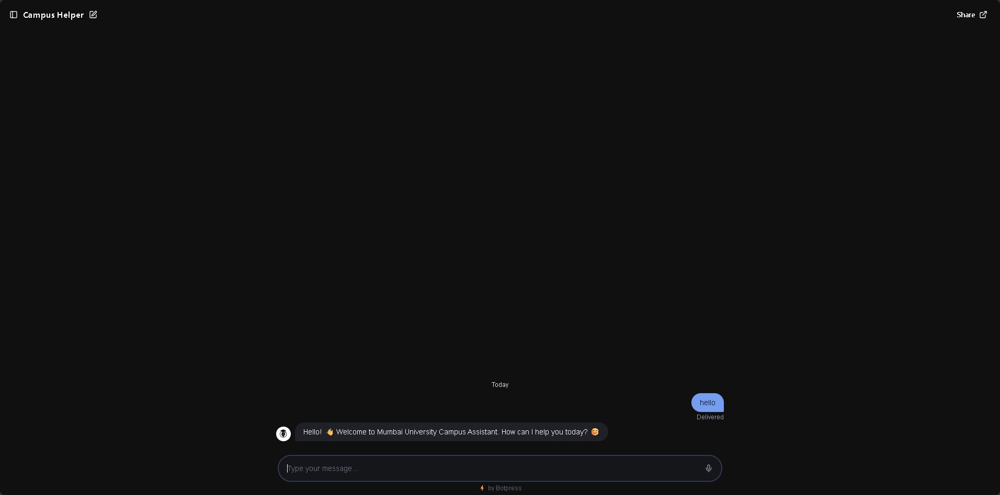
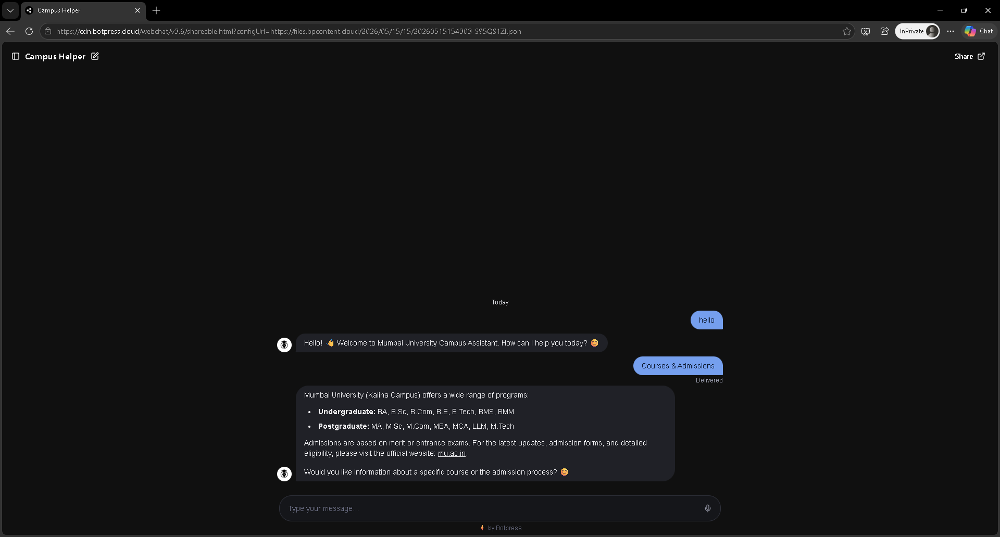
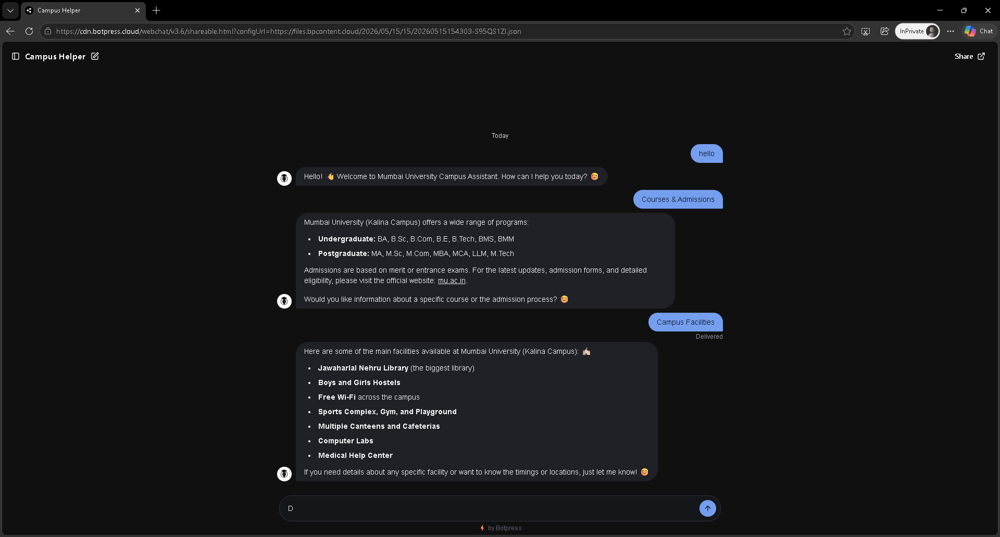
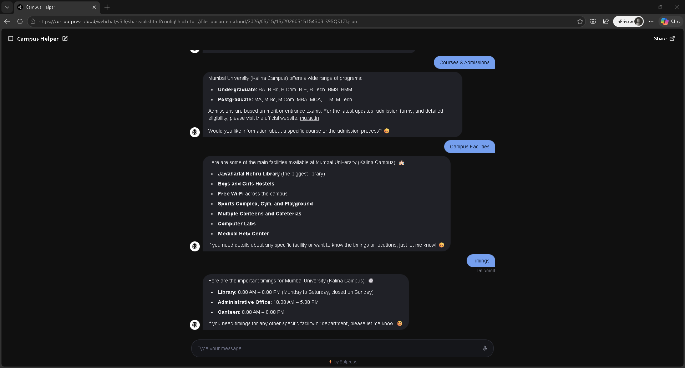
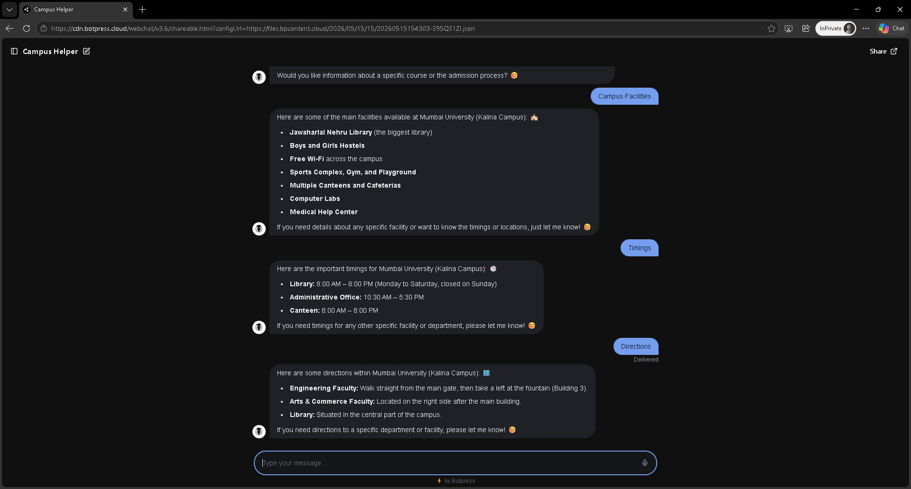

# Campus-Helper-Bot

🤖 An intelligent chatbot built for Mumbai University (Kalina Campus) students, parents, and visitors.

## 🎯 Objective
To provide 24/7 instant support regarding courses, admissions, facilities, events, timings, and campus navigation.

## ✨ Features
- Friendly AI-powered conversations
- Knowledge Base with official university information
- Quick reply buttons
- Smart fallback responses
- Professional web chat interface

## 🛠️ Technology Used
- **Platform**: Botpress Studio (AI Agent + Knowledge Base)
- **Technique**: Autonomous Node with Rich Text Knowledge Sources

## 🔗 Live Demo

**[🚀 Open Chatbot Here](https://cdn.botpress.cloud/webchat/v3.6/shareable.html?configUrl=https://files.bpcontent.cloud/2026/05/15/15/20260515154303-S95QS1ZI.json)**

## 📸 Screenshots

## 📄 Assignment Document
[Download Assignment Report](./assignment-document.pdf)

## How to Run / Test
1. Click on the Live Demo link above
2. Start chatting with the bot
3. Try queries like:
   - "What courses are available?"
   - "Library timings?"
   - "Campus facilities"
   - "How to reach engineering department?"

---

**Made with ❤️ for Mumbai University**

*Submitted as part of Chatbot Development Assignment*
